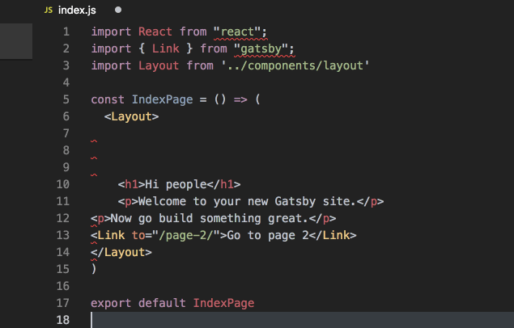

For purposes of this series of blog posts it helps if you are working in [VS Code](https://code.visualstudio.com/).  It's a free download and one of the best IDEs out there for all sorts of languages.  I generally eschew Microsoft, but I have to say VS Code is wonderful - full stop. I assume that you have worked through the [Gatsby Tutorial](https://next.gatsbyjs.org/tutorial/).  The Gallon Club is derived from the V2 [Gatsby Default Starter](https://github.com/gatsbyjs/gatsby-starter-default#v2) so in your terminal the following command should be familiar:

```
gatsby new gallonclub https://github.com/gatsbyjs/gatsby-starter-default\#v2
```
In the Gatsby codebase and many of the starters, you may seen files like eslintrc.json and .prettierrc.  These are used by ESLint and Prettier, but if you're new to JavaScript development and you haven't already configured them, you need to set them up for the default starter project. This involves installing few development dependecies.  The ones we need are eslint, eslint-plugin-prettier, and eslint-config-prettier. After you get into the project directory, you install them with the following command:

```
npm i eslint eslint-plugin-prettier eslint-config-prettier --save-dev
```

If you're new to this, note that you can see the effect of the install in the package.json file in the root of your project. It is shown below with the new lines highlighted. As of this writing, Prettier is already included in the default starter and the V2 Docs encourage you to use it. Professional JavaScript developers use these libraries implicitly so we should too.


```javascript{26-28}
{
  "name": "gatsby-starter-default",
  "description": "Gatsby default starter",
  "version": "1.0.0",
  "author": "Kyle Mathews <mathews.kyle@gmail.com>",
  "dependencies": {
    "gatsby": "next",
    "gatsby-plugin-react-helmet": "next",
    "gatsby-plugin-manifest": "next",
    "gatsby-plugin-offline": "next",
    "react": "^16.4.2",
    "react-dom": "^16.4.2",
    "react-helmet": "^5.2.0"
  },
  "keywords": [
    "gatsby"
  ],
  "license": "MIT",
  "scripts": {
    "build": "gatsby build",
    "develop": "gatsby develop",
    "format": "prettier --write '**/*.js'",
    "test": "echo \"Error: no test specified\" && exit 1"
  },
  "devDependencies": {
    "eslint": "^5.4.0",
    "eslint-config-prettier": "^3.0.1",
    "eslint-plugin-prettier": "^2.6.2",
    "prettier": "^1.14.2"
  },
  "repository": {
    "type": "git",
    "url": "https://github.com/gatsbyjs/gatsby-starter-default"
  }
}
```

As you can see, we've added a development dependency, which simply means it will be installed for the dev environment and ignored for the production build, The next thing that is required is an the eslint.json file, which contains the next bit confguration. If you look at the same file in the Gatsby project itself, you can see that there is a lot to learn. To keep it simple in The Gallon Club project, our file looks like this:

```
{
  "extends": [
    "react-app",
    "eslint:recommended",
    "plugin:prettier/recommended",
    "prettier",
    "prettier/react"
  ],
  "rules": {
    "prettier/prettier": [
      "error",
      {
        "bracketSpacing": true,
        "trailingComma": "all",
        "singleQuote": true
      }
    ]
  },
  "env": {
    "browser": true,
    "node": true,
    "es6": true
  },
    "plugins":[
    "prettier"
  ]
}
```

Again, being new to the ecosystem I knew it was possible, but I had to learn this through trial an error.  One inspiration for this was [this video](https://www.youtube.com/watch?v=YIvjKId9m2c) by Wes Bos.  When it comes to mining the internet for useful information, the dude abides.  The last piece of the puzzle is a bit of configuration in VS Code itself. In Code/Preferences/Settings amongst other settings you will need the block highlighted below:

```javascript{7-14}
{
  "editor.fontSize": 14,
  "editor.insertSpaces": false,
  "editor.renderIndentGuides": false,
  "workbench.colorTheme": "Ocean-Dark-Soda",
  "extensions.ignoreRecommendations": false,
  "[javascript]": {
    "editor.formatOnSave": false
  },
  "eslint.autoFixOnSave": true,
  "eslint.alwaysShowStatus": true,
  "prettier.disableLanguages": [
    "js"
  ],
  "files.autoSave": "onFocusChange",
  "javascript.updateImportsOnFileMove.enabled": "always",
  "window.zoomLevel": 0,
}
```

As Wes explains, these settings cause ESLint to auto correct errors in Javscript files and Prettier to do the formatting with other file types. 

####So what exactly have we done here?  

If everything is configured properly, you can edit /src/pages/index.js and try changing single quotes to doubles, add a couple of ending semicolons, and mess with line spacing and indenting as shown below.  Note the sqiggly red lines to indicate problems, which is nice, but the real magic happens when you save.  When you save, ESLint takes over and corrects all those mistakes for you.  Huzzah!  



I must confess, in the Tabs vs Spaces war I've always been a Tabs guy, but with this sort of set up I find myself less staunchly married to Tabs.  As I have immersed myself in JavaScript development, this setup reduces the cognitive load associated with such matters so one can concentrate energies on producing cool things rather than being pedantic about the code itself, and that alone is a powerful argument for using ESLint and Prettier.
