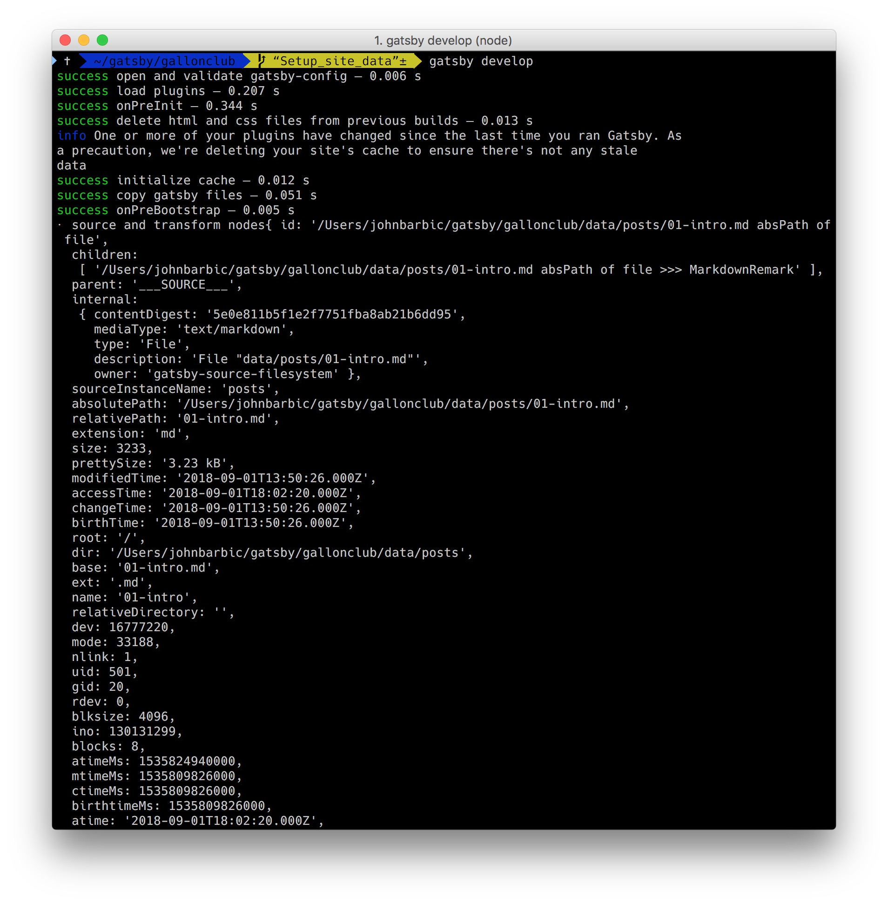
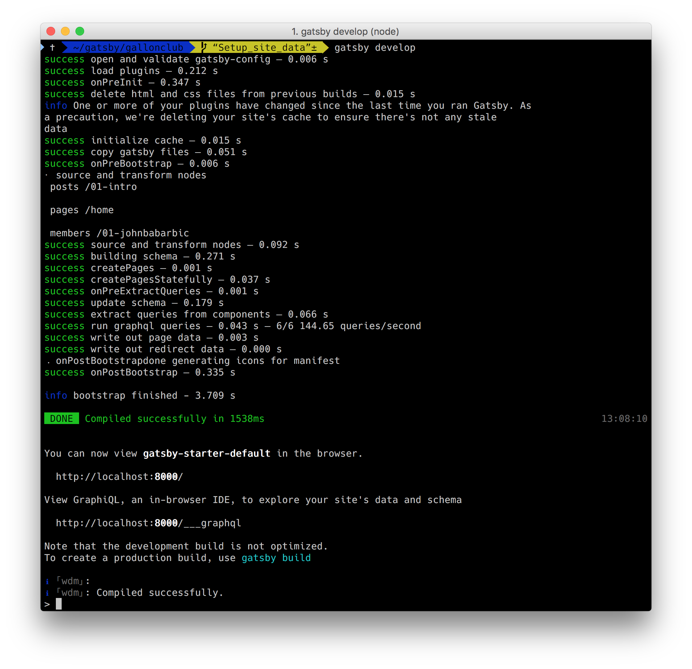
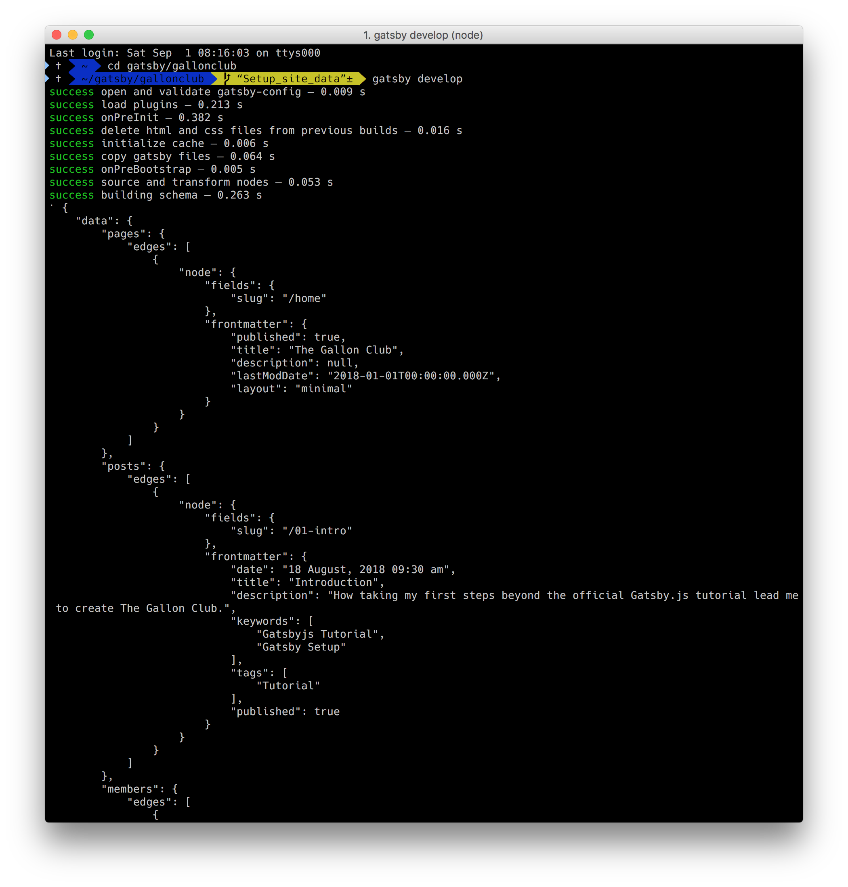

Having already been exposed to gatsby-node.js in the official tutorial, the installation of required plugins is straight forward. 

```
npm i --save gatsby-source-filesystem gatsby-transformer-remark

```

The configuration is in gatsby-config.js for the filesystem plugin is only slightly more complex that the official tutorial.  Because we've organized are files into several sub directories, we specify each one as part of the configuration.  The gatsby-config.js file from the default starter is shown below with the additional configuration highlighted below.

``` javascript{20-41}
module.exports = {
  siteMetadata: {
    title: 'Gatsby Default Starter',
  },
  plugins: [
    'gatsby-plugin-react-helmet',
    {
      resolve: `gatsby-plugin-manifest`,
      options: {
        name: 'gatsby-starter-default',
        short_name: 'starter',
        start_url: '/',
        background_color: '#663399',
        theme_color: '#663399',
        display: 'minimal-ui',
        icon: 'src/images/gatsby-icon.png', // This path is relative to the root of the site.
      },
    },
    'gatsby-plugin-offline',
    'gatsby-transformer-remark',
    {
      resolve: `gatsby-source-filesystem`,
      options: {
        path: `${__dirname}/data/posts`,
        name: 'posts',
      },
    },
    {
      resolve: `gatsby-source-filesystem`,
      options: {
        path: `${__dirname}/data/pages`,
        name: 'pages',
      },
    },
    {
      resolve: `gatsby-source-filesystem`,
      options: {
        path: `${__dirname}/data/members`,
        name: 'members',
      },
    },
  ],
}
```
With that configured, gatsby will be able to read our markdown files.  In the official tutorial the authors showed how to access information on each node.  As a reminder, in gatsby-node.js place the following code to log out the fileNodes:

```
exports.onCreateNode = ({ node, getNode }) => {
  if (node.internal.type === `MarkdownRemark`) {
    const fileNode = getNode(node.parent)

    console.log(fileNode)
  }
}

```

Now when you run "gatsby development" you will see the result of the console.log statement, which should look like the following excerpt:

Several lines down notice the "dir" element.  We can use that to automatically create a "slug" for any page in the system.  There are many examples of this in community starters, but the basic approach involves parsing the directory and using the file name to create a node field called, wait for it, "slug".  Change the gatsbys-config.js file as show below: 

```javascript{1,4-5,9-14,18-19}
const path = require('path')

exports.onCreateNode = ({ node, getNode, actions }) => {
  const { createNodeField } = actions
  let slug

  if (node.internal.type === `MarkdownRemark`) {
    const fileNode = getNode(node.parent)
    const parsedFilePath = path.parse(fileNode.relativePath)

    slug = `/${parsedFilePath.name}`

    const docTypeArray = fileNode.dir.split('/')
    const type = docTypeArray[docTypeArray.length - 1]

    console.log(type, slug)

    // Add slug as a field on the node.
    createNodeField({ node, name: `slug`, value: slug })
  }
}
```

We include "path" so that on line 9 we can parse the relative path of the Markdown file, and on line 11, get its name.  On lines 13 and 14 we're getting the type so that our console.log will show the type derived from data subdirectories and the slug. Now, if we run "gatsby develop" once more our log output looks like this:


Notice within all the "success" messages now we see the line "source and transform node" followed by our log statements which show all the directory and slug combinations from our data directory.  As they do in the official tutorial, let's make one more change to the gatsby-node.js file, add the following section to the bottom of the file as highlighted below.

```javascript{21-97}
const path = require('path')

exports.onCreateNode = ({ node, getNode, actions }) => {
  const { createNodeField } = actions
  let slug

  if (node.internal.type === `MarkdownRemark`) {
    const fileNode = getNode(node.parent)
    const parsedFilePath = path.parse(fileNode.relativePath)

    slug = `/${parsedFilePath.name}`

    // const docTypeArray = fileNode.dir.split('/')
    // const type = docTypeArray[docTypeArray.length - 1]
    // console.log(`\n`, type, slug)
    // Add slug as a field on the node.
    createNodeField({ node, name: `slug`, value: slug })
  }
}

exports.createPages = ({ actions, graphql }) => {
  //three named queries...note the use of glob filtering here
  return new Promise((resolve, reject) => {
    graphql(`
      {
        pages: allMarkdownRemark(
          filter: {
            fileAbsolutePath: { glob: "**/data/pages/**" }
            frontmatter: { published: { ne: false } }
          }
        ) {
          edges {
            node {
              fields {
                slug
              }
              frontmatter {
                published
                title
                description
                lastModDate
                layout
              }
            }
          }
        }

        posts: allMarkdownRemark(
          sort: { order: DESC, fields: [frontmatter___date] }
          filter: {
            fileAbsolutePath: { glob: "**/data/posts/**" }
            frontmatter: { published: { ne: false } }
          }
        ) {
          edges {
            node {
              fields {
                slug
              }
              frontmatter {
                date(formatString: "DD MMMM, YYYY hh:mm a")
                title
                description
                keywords
                tags
                published
              }
            }
          }
        }

        members: allMarkdownRemark(
          sort: { order: DESC, fields: [frontmatter___joined] }
          filter: {
            fileAbsolutePath: { glob: "**/data/members/**" }
            frontmatter: { published: { ne: false } }
          }
        ) {
          edges {
            node {
              fields {
                slug
              }
              frontmatter {
                joined
                name
                published
              }
            }
          }
        }
      }
    `).then(result => {
      console.log(JSON.stringify(result, null, 4))
      resolve()
    })
  })
}

```
The interesting thing to note is graphql section where we have three distinct queries that will drive the createPages function.  Each named query uses a filter to only get published files from one of the named directories.  That will allow us to create unique pages for each directory later on.  We're not actually creating them yet,  for now the log will show that we are indeed quering our Markdown files and have everything we need to start populating pages from our "database." 



Now that our "database" is defined and we have some seed data, it's time to start working on the frontend.


