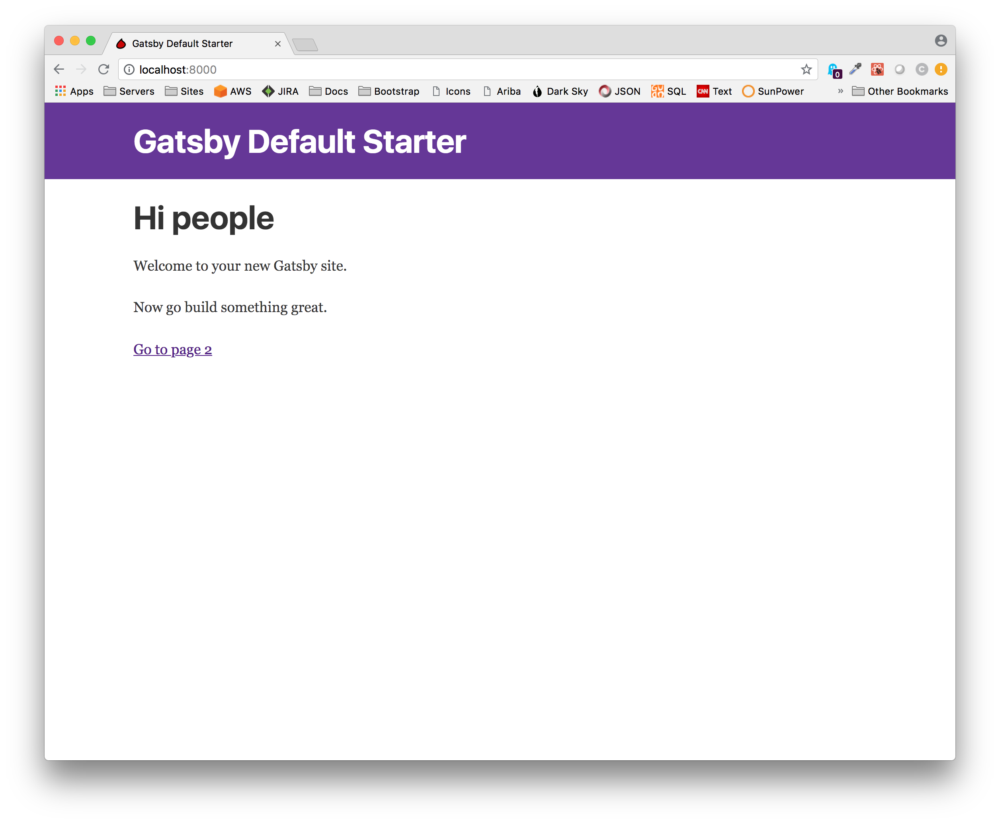
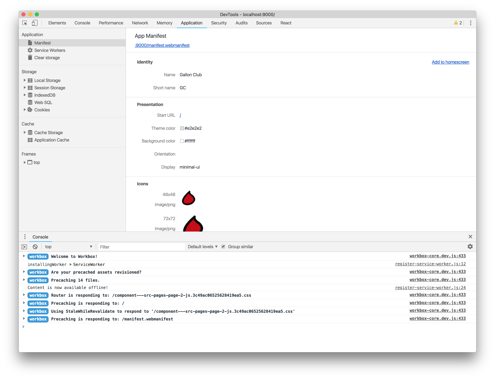

In the course of write the first few blog posts about the Gallon Club, I noticed the default starter's gatsby-config.js file had sections for gatsby-plugin-manifest and gatsby-plugin-offline.  So before building out the UI for the site, I thought I would take a little detour.  If a framework is going to offer you offline support for free, why not take advantage of it?  

As with any plugin we have to install it for the project (and see it added to package.json). 
```
npm install --save gatsby-plugin-manifest gatsby-plugin-offline
```

With those installed, all I had to do next was to add my logo image and modify the relevant section of the gatsby-config.js file as shown in the highlighted row below.

```javascript{8-19}
module.exports = {
  siteMetadata: {
    title: 'Gatsby Default Starter',
  },
  plugins: [
    'gatsby-plugin-react-helmet',
    {
      resolve: `gatsby-plugin-manifest`,
      options: {
        name: 'Gallon Club',
        short_name: 'GC',
        start_url: '/',
        background_color: '#ffffff',
        theme_color: '#e2e2e2',
        display: 'minimal-ui',
        icon: 'images/logo.png',
      },
    },
    'gatsby-plugin-offline',
    'gatsby-transformer-remark',
    {
      resolve: `gatsby-source-filesystem`,
      options: {
        path: `${__dirname}/data/posts`,
        name: 'posts',
      },
    },
    {
      resolve: `gatsby-source-filesystem`,
      options: {
        path: `${__dirname}/data/pages`,
        name: 'pages',
      },
    },
    {
      resolve: `gatsby-source-filesystem`,
      options: {
        path: `${__dirname}/data/members`,
        name: 'members',
      },
    },
  ],
}
```

Running "gatsby develop" generates the following.  It may not look like much, but now the favicon is showing and behind the scenes we now have offline support baked in to our budding application.    



To prove it, I ran "gatsby build" and served the production build locally. I opened up developer tools and feast my eyes on the magnificence, and we have icons for free. 



There is so much complexity to deal with in software development that when you see something like this, it feels like magic.  Once you start playing around with Gatsby, there's a lot of that.  It's part of the joy I wrote about earlier and part of the reason I wanted to write about the experience to encourage others, especially beginners, to join in the fun.
