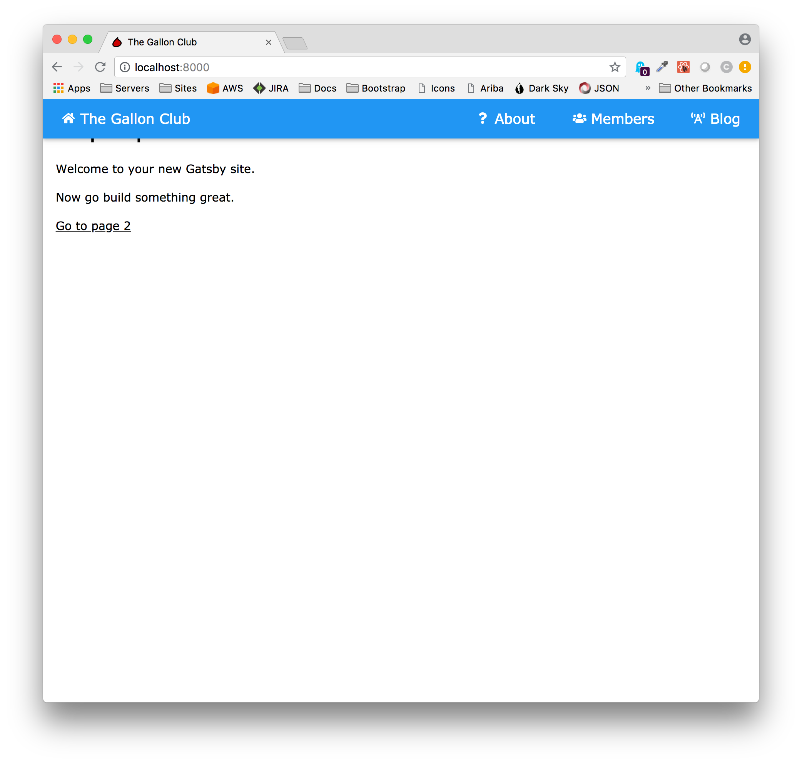
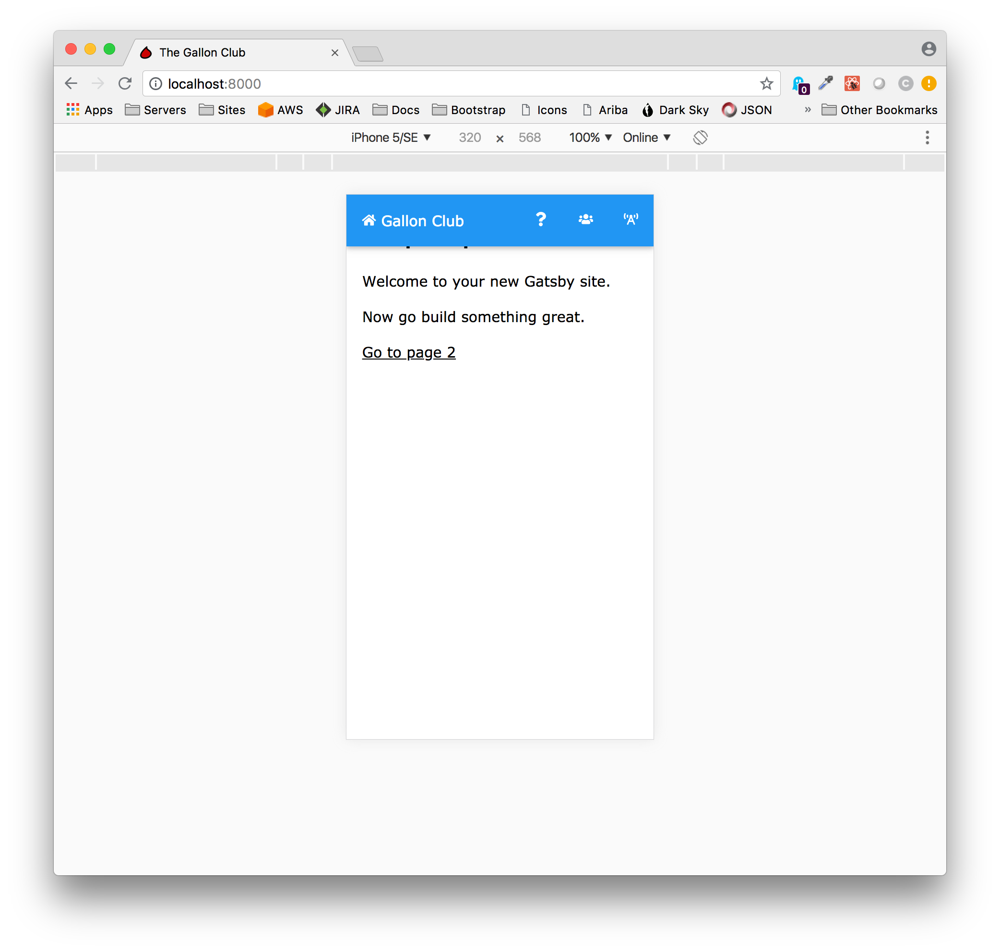

 The menu for the Gallon Club consists of options for home, about, members, and the blog.  Because our design in mobile first, we're using the site title as the text of the home link.  This insures our "brand" will be front and center when users come to their site from their phones without using other screen real estate for that purpose.

Creating the menu for the Gallon Club requires two changes from the default starter.  

#### 1. Modify /components/Header.js
The code is greatly simplified because we are abstracting the menu code out into a separate component.  I've chosen to destructure the siteTitle variable from props before passing it into the the menu component.

As an aside, If you're confused about what destructuring is, [this video](https://www.youtube.com/watch?v=_ApRMRGI-6g) (again by Wes Bos) is an excellent explanation.  Using destructuring explicitly makes clear what variable is being used in the insuing code.  Even though this is a very simple case, you can clearly understand what it is and where it comes from, and this improves the readability of the code.  In addition, if we ever come back and add another variable later it will be clear where to do so.   

```javascript{6,8-9}
import React from 'react'
import Menu from './Menu'

class Header extends React.Component {
  render() {
    const { siteTitle } = this.props
    return (
      <div className="w3-top">
        <Menu siteTitle={siteTitle} />
      </div>
    )
  }
}

export default Header

```

#### 2. Create /components/Menu.js
The menu code is relatively straight forward.  The first thing to note is how easy it is to use React Icons.  You simply import whatever icon you wish to use, and add a tag using the same name. The second thing to note is how the menu makes use of W3.CSS class for both desktop and mobile variants.  The nice thing about this is there is no additional JavaScript required to get the look and feel we're after.  Finally, the menu code leverages Gatsby Link.

```
import React from 'react'
import { Link } from 'gatsby'
import { FaHome } from 'react-icons/fa'
import { FaQuestion } from 'react-icons/fa'
import { FaUsers } from 'react-icons/fa'
import { FaBroadcastTower } from 'react-icons/fa'
// ES6 Class has access to local state.
class Menu extends React.Component {
  render() {
    const { siteTitle } = this.props
    return (
      <>
        <div
          id="largeScreens"
          className="w3-bar w3-blue w3-card w3-left-align w3-large"
        >
          <Link
            to="/"
            className="w3-bar-item w3-button w3-hide-small w3-padding-large w3-hover-white"
          >
            <FaHome style={{ paddingTop: '3px' }} /> {siteTitle}
          </Link>
          <Link
            to="/blog/"
            className="w3-bar-item w3-button w3-hide-small w3-padding-large w3-hover-white w3-right"
          >
            <FaBroadcastTower style={{ paddingTop: '3px' }} /> Blog
          </Link>
          <Link
            to="/members/"
            className="w3-bar-item w3-button w3-hide-small w3-padding-large w3-hover-white w3-right"
          >
            <FaUsers style={{ paddingTop: '3px' }} /> Members
          </Link>
          <Link
            to="/about/"
            className="w3-bar-item w3-button w3-hide-small w3-padding-large w3-hover-white w3-right"
          >
            <FaQuestion style={{ paddingTop: '3px' }} /> About
          </Link>
        </div>
        <div
          id="smallScreens"
          className="w3-bar w3-blue w3-card w3-left-align w3-hide-large w3-hide-medium w3-medium"
        >
          <Link
            to="/"
            className="w3-bar-item w3-button w3-padding-16 w3-hover-white"
          >
            <FaHome style={{ paddingTop: '2px' }} /> Gallon Club
          </Link>
          <Link
            to="/blog/"
            className="w3-bar-item w3-button w3-padding-16 w3-hover-white w3-right"
          >
            <FaBroadcastTower />
          </Link>
          <Link
            to="/members/"
            className="w3-bar-item w3-button w3-padding-16 w3-hover-white w3-right"
          >
            <FaUsers />
          </Link>
          <Link
            to="/about/"
            className="w3-bar-item w3-button w3-padding-16 w3-hover-white w3-right"
          >
            <FaQuestion />
          </Link>
        </div>
      </>
    )
  }
}

export default Menu

```
So what have created?  The desktop context is shown below.



In the mobile context, we have limited screen real estate so the menu is reduced a bit. (The view below is the iPhone 5 emulator in Chrome Dev tools.)   


Finally, the Gallon Club is starting to look a little different from the default starter.  But, as you are reading the completed application you don't have to rely on the pictures.  If you're viewing the app on a phone you can see the menu in action.  If you are viewing the app on a laptop, you can resize the browser and see how the CSS changes the menu.

Next up, we'll create the Footer component.

