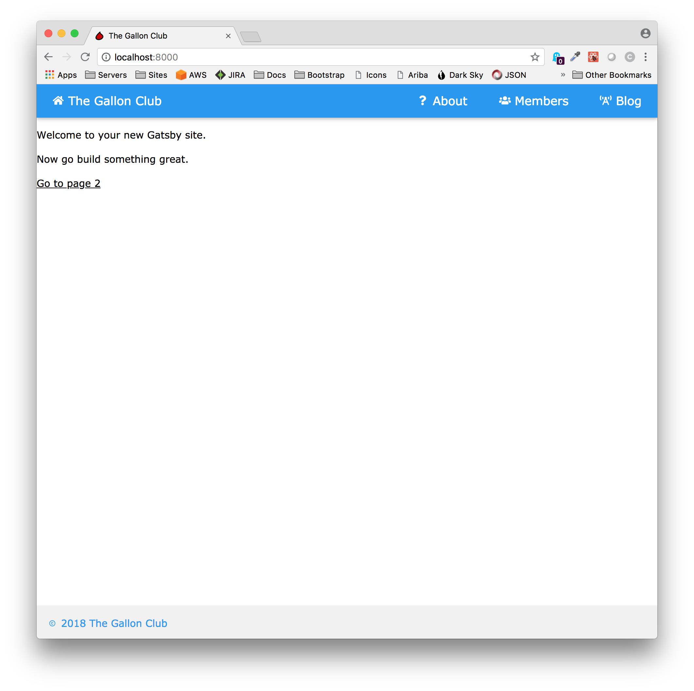
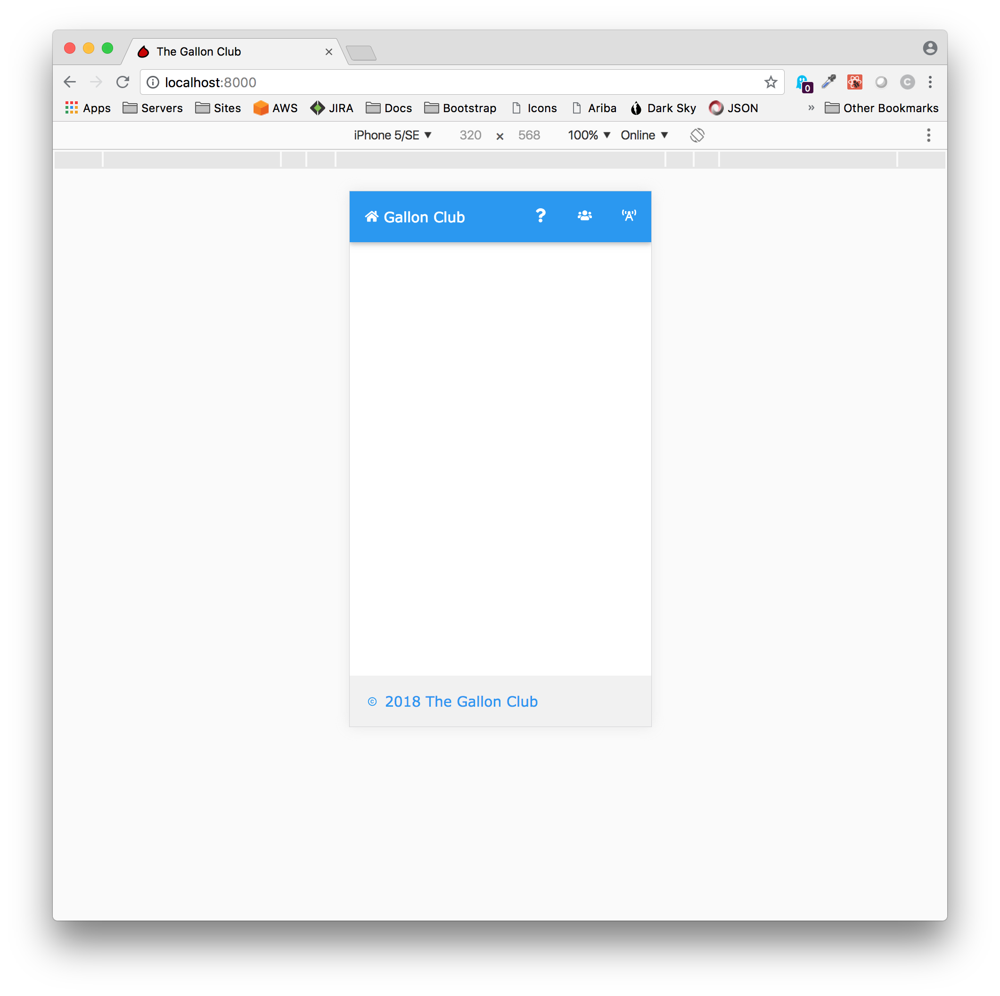

 The footer for the Gallon Club consists of a simple copyright note which is built from the date and the site title.  The code is similar to what we created in the Menu component and uses the same destructuring for the siteTitle.  The only addition is the use of JavaScript to derive the year from the current date.  Finally, we levarage React Icons to give the notice a little flair.

 ```
import React from 'react'
import { MdCopyright } from 'react-icons/md'

class Footer extends React.Component {
  render() {
    const tempDate = new Date()
    const year = tempDate.getFullYear()
    const { siteTitle } = this.props

    return (
      <div className="w3-light-grey w3-container w3-padding-16 w3-text-theme">
        <MdCopyright style={{ fontSize: '16px', paddingTop: '5px' }} /> {year}{' '}
        {siteTitle}
      </div>
    )
  }
}

export default Footer
```
To implement the footer we need to modify the Layout.  There are three changes:

  1. Import the Footer component.
  2. Insert the tag
  3. Modify the existing div wrapper and set its minimum height to 800px.


```javascript{6,32,33}
import React from 'react'
import PropTypes from 'prop-types'
import { StaticQuery, graphql } from 'gatsby'
import Head from './Head'
import Header from './Header'
import Footer from './Footer'
import css from 'w3-css/w3.css'
import style from './layout.css'

const Layout = ({ children, pagekeywords = '', pagedescription = '' }) => (
  <StaticQuery
    query={graphql`
      query SiteTitleQuery {
        site {
          siteMetadata {
            title
            intro
            description
            keywords
          }
        }
      }
    `}
    render={data => (
      <>
        <Head
          data={data}
          pagedescription={pagedescription}
          pagekeywords={pagekeywords}
        />
        <Header siteTitle={data.site.siteMetadata.title} />
        <div style={{ minHeight: '800px' }}>{children}</div>
        <Footer siteTitle={data.site.siteMetadata.title} />
      </>
    )}
  />
)

Layout.propTypes = {
  children: PropTypes.node.isRequired,
}

export default Layout

```

With those changes done the web context should look like this:



And the mobile context should look like this:



Next, it's time to create the templates that are used to render the pages that make up the application.